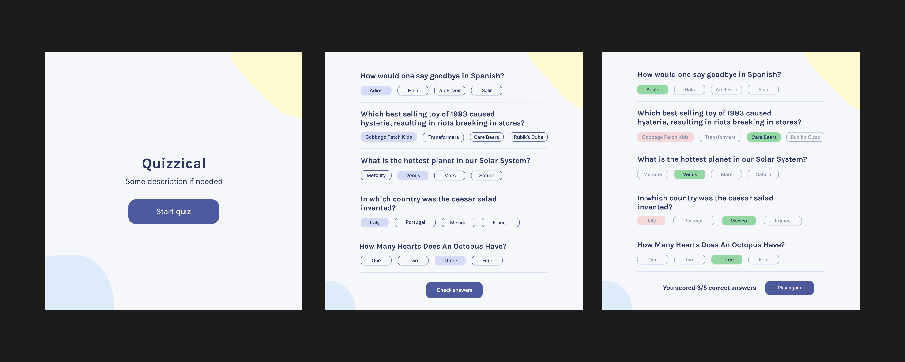

# scrimba-quizzical
Quizzical trivia game built with React for Scrimba's Frontend Developer program

## Design

## Requirements
- Two Screens to conditionally render (Start Screen, Questions)
- Use [OTDB (open trivia API)](https://opentdb.com/api_config.php) to get trivia questions
- Users can to select different answers to multiple choice questions
- Tally correct answers after "Check Answers" is clicked
- Style/Polish following design

## Technology
- Uses React
- Built using Vite
- Deployed via Netlify